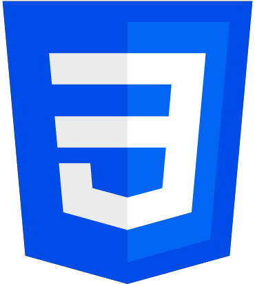
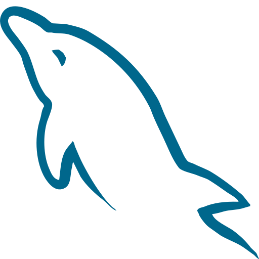
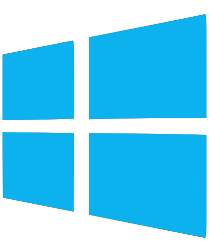

## Hey there, I'm Nathan 👋

I'm a Computer Systems Technology graduate from BCIT currently looking for a job in software. As someone with a passion for music and art, I approach coding from a design perspective, looking for elegant solutions and creating well-structured programs.

I'm currently working on an application to help musicians keep track of information about their songs, whether it be specific equipment settings or sheet music. If you are interested in my profile please contact me at  [nathanb1357@gmail.com](https://nathanb1357@gmail.com)

### Languages:

  

### Libraries:

  

### Applications:

